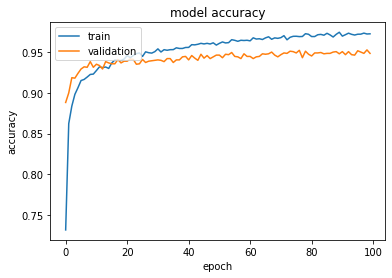
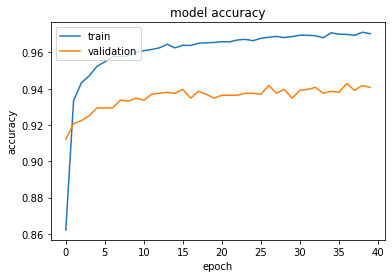

# Comparaison-between-Gan-data-augmentation-and-traditional-data-augmentation

In this project i compared the effect of applying GAN for data augmantation to traditional data augmentation techniques. 
The dataset used in that project is  [NotMnist](https://www.kaggle.com/datasets/lubaroli/notmnist).

<h2> Accuracy with traditional techniques of data augmentation: 
  
 
  
  <h2> Accuracy with GAN: 
  

    
   

